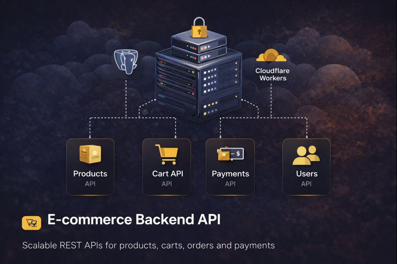

# ⚡ Flash Deliveries — Backend API

The **Flash Deliveries API** powers a unified **grocery + restaurant delivery platform**, providing authentication, catalog management, orders, and media workflows for all client applications.

This backend is designed for **edge performance and scalability**, running on **Cloudflare Workers** using **Hono**.

🔗 Related Repositories:
- Admin Dashboard: https://github.com/<your-username>/flash-deliveries-admin
- Customer Web App: https://github.com/<your-username>/flash-deliveries-web
- Customer Mobile App: https://github.com/<your-username>/flash-deliveries-mobile

---

## 🧩 Platform Responsibilities

- Authentication & role-based access
- Product & restaurant catalog management
- Order lifecycle handling
- Media upload workflows
- API contracts for web & mobile clients

---

## 🔌 Tech Stack

- **Framework**: Hono (Cloudflare Workers)
- **Database**: Cloudflare D1
- **ORM**: Drizzle
- **Validation**: Zod + OpenAPI
- **Auth**: JWT
- **Storage (pluggable)**: Cloudinary / Supabase
- **Email (optional)**: Resend / MailerSend

---

## ✨ Key Features

- Schema-first API using **Zod OpenAPI**
- JWT authentication with role-based guards
- Request validation & rate limiting
- Shared API for store & restaurant flows
- Cloudflare-native deployment

---

## 📸 API Screenshots
(Coming Soon)

🧪 Local Development
npm install
npm run dev

🚀 Deployment (Cloudflare Workers)
npm run deploy

🔁 Cloudflare Type Generation
npm run cf-typegen

Usage example:

const app = new Hono<{ Bindings: CloudflareBindings }>()

🛣️ Roadmap

Unified checkout support

Real payment gateway integration

Push notification hooks

Advanced analytics endpoints
